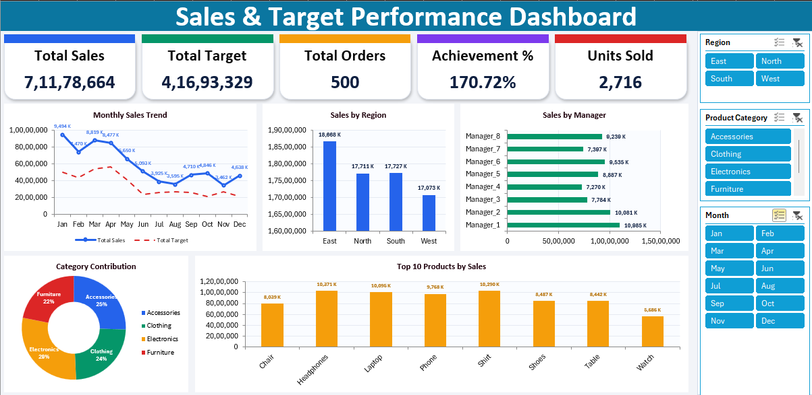

# 📊 Sales & Target Performance Dashboard – Excel

An interactive **Sales & Target Performance Dashboard** built using **Microsoft Excel** to analyze sales performance, target achievement, salesperson productivity, regional performance, and key business KPIs.

The dashboard transforms raw sales data into an easy-to-understand visual report that helps users monitor performance and identify areas requiring attention.

---

## 🚀 Project Overview

The **Sales & Target Performance Dashboard** provides a consolidated view of sales performance against predefined targets.

It enables users to:

* Track total sales and sales targets
* Measure target achievement percentage
* Analyze salesperson performance
* Compare actual sales with targets
* Identify high and low-performing regions
* Monitor monthly sales trends
* Analyze product/category performance
* Filter and explore data interactively

---

## 🎯 Key Objectives

* Analyze overall sales performance
* Compare **Actual Sales vs Target Sales**
* Measure target achievement
* Identify top-performing sales representatives
* Analyze regional sales performance
* Track monthly sales trends
* Provide actionable business insights
* Build an interactive Excel dashboard

---

## 🛠️ Tools & Technologies

* **Microsoft Excel**
* Pivot Tables
* Pivot Charts
* Excel Formulas
* Slicers
* Conditional Formatting
* Excel Tables
* Data Cleaning
* Data Transformation
* Data Visualization

---

## 📈 Key Performance Indicators

| KPI                      | Description                                |
| ------------------------ | ------------------------------------------ |
| **Total Sales**          | Overall sales generated                    |
| **Sales Target**         | Total assigned sales target                |
| **Target Achievement %** | Percentage of target achieved              |
| **Target Variance**      | Difference between actual sales and target |
| **Total Orders**         | Number of sales transactions               |
| **Average Sales**        | Average sales value per order              |
| **Top Salesperson**      | Salesperson with the highest performance   |
| **Top Region**           | Region contributing the highest sales      |

---

## 📊 Dashboard Analysis

### Sales Performance

Analyzes actual sales against assigned targets to understand overall business performance.

### Target Achievement

Measures how much of the assigned sales target has been achieved.

**Formula:**

```text
Target Achievement % = Actual Sales / Sales Target × 100
```

### Salesperson Performance

Compares sales representatives based on:

* Actual Sales
* Sales Target
* Target Achievement %
* Target Variance

### Regional Performance

Analyzes sales across regions to identify differences in regional performance and contribution.

### Monthly Sales Trend

Tracks sales performance over time to identify:

* Growth trends
* High-performing months
* Low-performing months
* Seasonal patterns

### Product / Category Analysis

Analyzes sales contribution across different products or categories.

---

## 🎛️ Interactive Dashboard Features

The dashboard includes:

* Interactive **Slicers**
* Pivot Tables
* Pivot Charts
* KPI Cards
* Conditional Formatting
* Dynamic filtering
* Interactive data exploration

Users can filter the dashboard based on available dimensions such as:

* Month
* Region
* Salesperson
* Product
* Category

---

## 🧹 Data Preparation

The dataset was prepared before dashboard development through:

1. Removing duplicate records
2. Handling missing values
3. Standardizing data formats
4. Formatting date fields
5. Validating numerical values
6. Creating calculated columns
7. Structuring data using Excel Tables
8. Preparing data for Pivot Table analysis

---

## 📐 Key Calculations

### Target Achievement %

```text
Target Achievement % = Actual Sales / Sales Target × 100
```

### Target Variance

```text
Target Variance = Actual Sales - Sales Target
```

### Average Sales

```text
Average Sales = Total Sales / Number of Orders
```

### Sales Contribution

```text
Sales Contribution % = Category Sales / Total Sales × 100
```

---

## 📁 Project Structure

```text
Sales-Target-Performance-Dashboard/
│
├── README.md
├── Sales_Target_Performance_Dashboard.xlsx
│
└── screenshots/
    └── dashboard.png
```

---

## 📸 Dashboard Preview





---

## 💡 Business Insights

This dashboard can help identify:

* Salespersons exceeding their targets
* Salespersons below their targets
* High-performing regions
* Underperforming regions
* Monthly sales patterns
* Products/categories contributing to sales
* Actual sales versus target gaps
* Overall sales performance

---

## 🧠 Skills Demonstrated

* Data Analysis
* Microsoft Excel
* Data Cleaning
* Data Transformation
* Pivot Tables
* Pivot Charts
* KPI Development
* Dashboard Development
* Data Visualization
* Sales Analytics
* Target Analysis
* Business Intelligence
* Business Performance Analysis

---

## 👨‍💻 Author

**[Dhayalan B](https://dhayalan-b.vercel.app/)**

B.Tech – Artificial Intelligence & Machine Learning

Aspiring Data Analyst

[GitHub](https://github.com/DhayalanSD) • [Portfolio](https://dhayalan-b.vercel.app/)

---

⭐ **If you find this project useful, consider giving the repository a star!**
